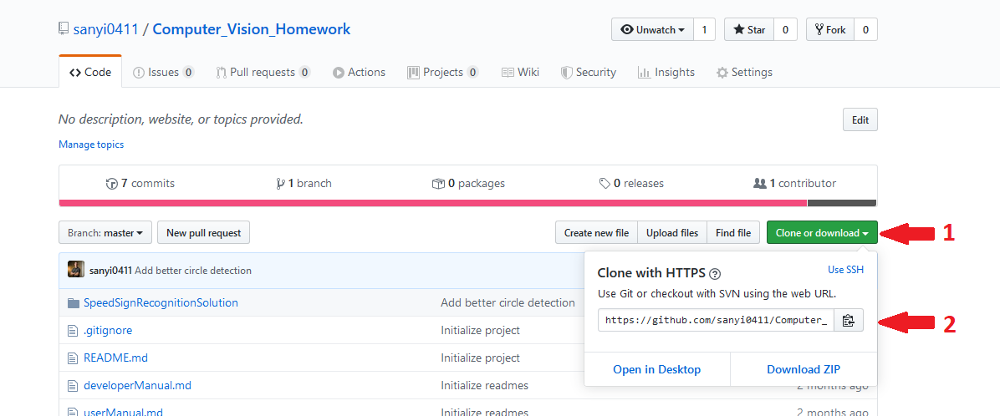

# Developer Manual

###1. Environment
- To compile this code you will need [Visual Studio](https://visualstudio.microsoft.com/downloads/) and OpenCV.
- On how to install OpenCV check out my [How to install OpenCV](https://github.com/sanyi0411/Tutorials/tree/master/How%20to%20install%20OpenCV) generic tutorial

###2. Compilation
- Clone the repo using *git clone <url>*

- Open the *SpeedSignRecognitionSolution.sln* file with Visual Studio
- Press *Ctrl + Shift + B* to build the solution
- This will generate an *.exe* file
- If you don't want to always run this exe from command line, you can supply arguments from Visual Studio, just like if you were from command line. Check out [this](https://dailydotnettips.com/how-to-pass-command-line-arguments-using-visual-studio/) site